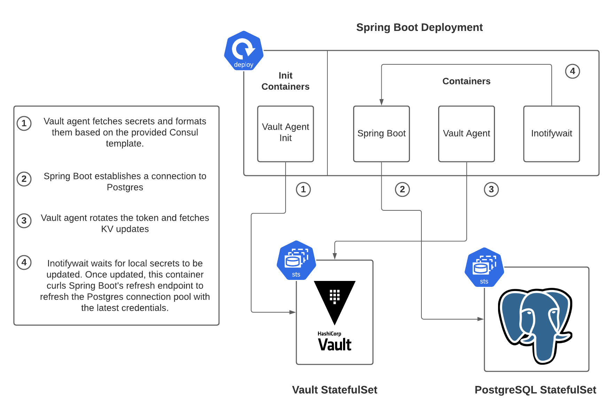

# Auto-Refreshing Spring Connection Pools on Kubernetes with Vault

Accompanying Blog Post: TBD

This is a quick demo covering how you can automatically refresh Spring's Connection pool when Vault Agent pulls in updated database credentials. Below demonstrates the architecture you will build.



## Prerequisites

This demo assumes you have the following tools installed on your local machine:
* minikube
* kubectl
* vault (cli)
* helm
* psql

## Setup

This section will set up Vault and Postgres, which Spring Boot will interact with to demonstrate the connection pool auto-refresh.

1. Start your minikube cluster
   ```bash
   minikube start
   ```
   The instructions after this point assume the `default` namespace.
1. Run the [install-vault.sh](./setup/install-vault.sh) script. This script installs Vault in "Dev Server Mode" and adds an initial set of database credentials to a KV store. The username stored is "widget_blue", and the password is "widget_blue_pass"
   ```bash
   cd setup
   ./install-vault.sh
   ```
1. Run the [install-postgres.sh](./setup/install-postgres.sh) script. This script installs Postgres and configures Postgres by running the [postgres-setup.sql](setup/postgres-setup.sql) script. It also creates the "widget_blue" role with the password "widget_blue_pass"
   ```bash
   ./install-postgres.sh
   ```

## Deploying the Spring Boot App

This section deploys the Spring Boot app by using the [postgres-vault-example/deploy.yaml](./postgres-vault-example/deploy.yaml) script. The contents of this file are described in the accompanying blog post.

Apply this file by running the command below:

```bash
kubectl apply -f postgres-vault-example/deploy.yaml
```

Wait until the application is ready before continuing (you should see 3/3 containers ready). You can check this status by running:

```bash
kubectl get pods
```

### Inspecting your App
Let's take a look at what was actually deployed.

1. Check the logs from the Vault Agent init container that ran to preload your database credentials from Vault
   ```bash
   kubectl logs deploy/spring-boot-postgres -c vault-agent-init
   ```
   You should see these lines:
   ```
   watching 1 dependencies
   all templates rendered
   ```
   This indicates that Vault Agent was able to generate your application.properties file, fetching the Postgres username and password from Vault and adding them to the properties file.
1. Check the logs from the Vault Agent sidecar
   ```bash
   kubectl logs deploy/spring-boot-postgres -c vault-agent
   ```
   You should see these lines:
   ```
   (runner) creating watcher
   (runner) starting
   auth.handler: renewed auth token
   ```
   This indicates that Vault Agent has renewed your token so it can later authenticate and fetch the updated Postgres credentials, when we update them later on in this demo.
1. Check the logs from the inotifywait sidecar
   ```bash
   kubectl logs deploy/spring-boot-postgres -c inotifywait
   ```
   You should see these lines:
   ```
   Setting up watches.
   Watches established
   ```
   This indicates that inotifywait is waiting for your application.properties file to be modified. This will happen when you update the Postgres credentials in Vault later in the demo.
1. Finally, you can check the logs from the "main" container, which contains the Spring Boot app.
   ```bash
   kubectl logs deploy/spring-boot-postgres -c main
   ```
   Ensure that there aren't any errors in the logs (WARN is fine, for this demo)

### Accessing Your App
Let's access the app to make sure it has retrieved the Postgres credentials from Vault fine and is able to interact with Postgres.

1. Run the kubectl port-forward command to forward local port 8080 to your pod.
   ```
   kubectl port-forward svc/spring-boot-postgres 8080:8080
   ```
1. In a separate terminal, ensure that your can run the following commands:
   ```
   curl localhost:8080/
   curl localhost:8080/save -H "Content-Type: application/json" -d '{"firstName":"John", "lastName": "Doe"}'
   curl localhost:8080/findall
   ```
   If these commands work, this means that Vault Agent init successfully fetched your DB credentials from Vault, and Spring Boot used those credentials to establish a connection.

Now, let's see what happens when credentials need to be rotated and how Spring Boot's connection pool can be automatically refreshed.

## Rotating the Database Credentials
Run the [rotate-credentials.sh](setup/rotate-credentials.sh) script to rotate the database credentials. This script does the following things:
* Creates a new role in Postgres called "widget_green" with the password "widget_green_pass".
* Updates the database KV store in Vault to `username=widget_green password=widget_green_pass`

Run this script using the command below:
```bash
cd setup
./rotate-credentials.sh
```

Wait about 5 minutes to allow Vault Agent the chance to fetch the new credentials and update your application.properties file. Then continue to the next section.

### Inspecting Your App
Let's see how your app responded when the DB credentials were rotated. We'll explore this by once again looking at the logs.

1. Check the Vault Agent logs to see if it fetched the new DB credentials
   ```bash
   kubectl logs deploy/spring-boot-postgres -c vault-agent
   ```
   You should see this line in the log:
   ```
   (runner) rendered "(dynamic)" => "/deployments/config/application.properties"
   ```
   This indicates that Vault Agent updated the application.properties file with the new credentials.
1. Check the inotifywait logs to see if it responded to the application.properties update.
   ```bash
   kubectl logs deploy/spring-boot-postgres -c inotifywait
   ```
   You should see these lines in the log:
   ```
     % Total    % Received % Xferd  Average Speed   Time    Time     Time  Current
                                    Dload  Upload   Total   Spent    Left  Speed
   100    59    0    59    0     0    268      0 --:--:-- --:--:-- --:--:--   269
   Setting up watches.
   Watches established.
   ```
   This indicates that inotifywait detected a change to application.properties and ran `curl` against the `/actuator/refresh` endpoint to refresh Spring Boot's connection pool.
1. Check the Spring Boot logs to make sure there aren't any errors related to connecting to Postgres.
   ```bash
   kubectl logs deploy/spring-boot-postgres -c main
   ```

Let's access the app one more time to make sure the application still functions as expected with the new credentials.

### Accessing Your App
Follow these steps to access your app again:
1. If you are still port-forwarding port 8080 to svc/spring-boot-postgres, continue to run that in a separate terminal. Otherwise, run the command again:
   ```bash
   kubectl port-forward svc/spring-boot-postgres 8080:8080
   ```
1. Run these commands once again to ensure the app is working. You should be able to save and fetch from the DB exactly like before:
   ```bash
   curl localhost:8080/
   curl localhost:8080/save -H "Content-Type: application/json" -d '{"firstName":"Another", "lastName": "User"}'
   curl localhost:8080/findall
   ```

If you are still able to run these commands successfully, then you have completed this demo! You successfully auto-refreshed Spring's connection pool!

## Next Steps
1. In a real-world setting, you would want to also "disable" the old `widget_blue` Postgres role. You can do this by running the command:
   ```bash
   psql -h localhost -U postgres widget -c "ALTER ROLE widget_blue NOLOGIN;"
   ```

1. If you want to see how Spring Boot responds in a failure scenario for comparison, you can add a random username/password to Vault with this command:
   ```bash
   vault kv put secret/myapp/config username=random password=randompass
   ```
   You should start to see errors in the Spring Boot container in about 5 minutes, and the `/save` and `/findall` endpoints should no longer work.
